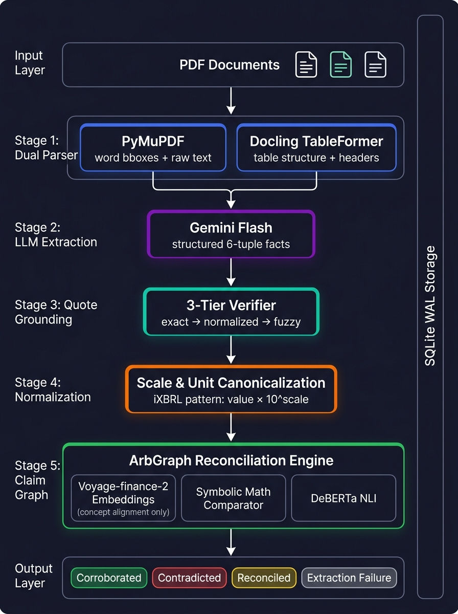
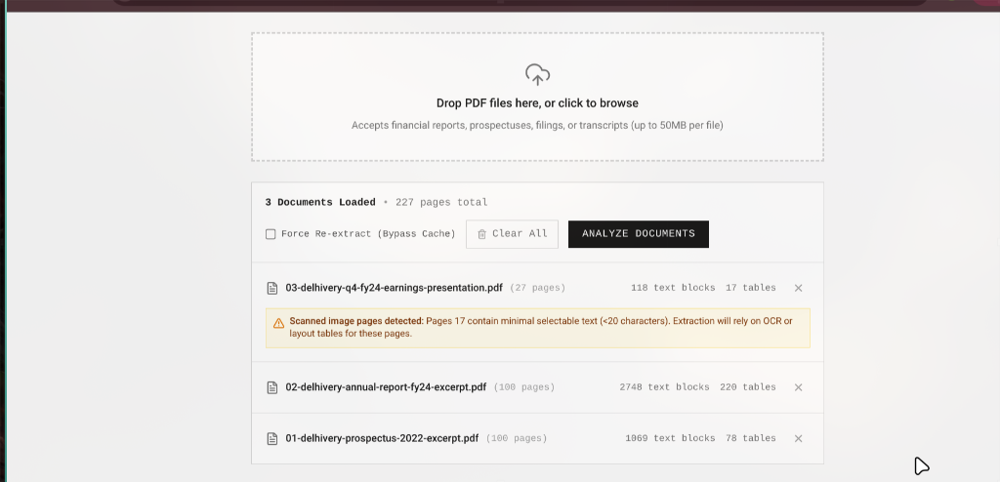
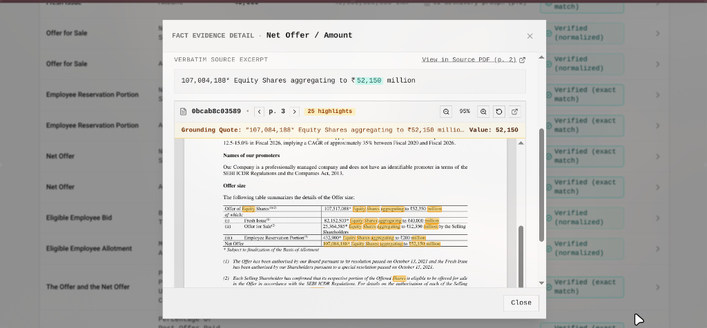
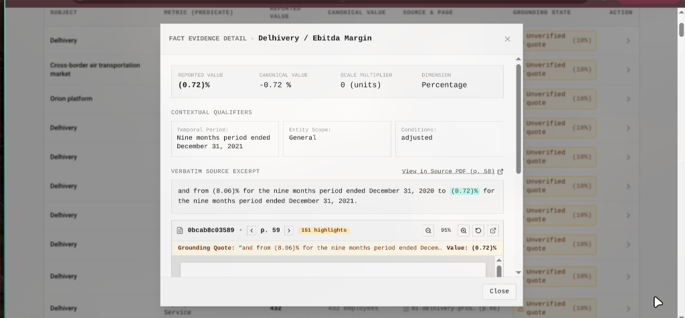
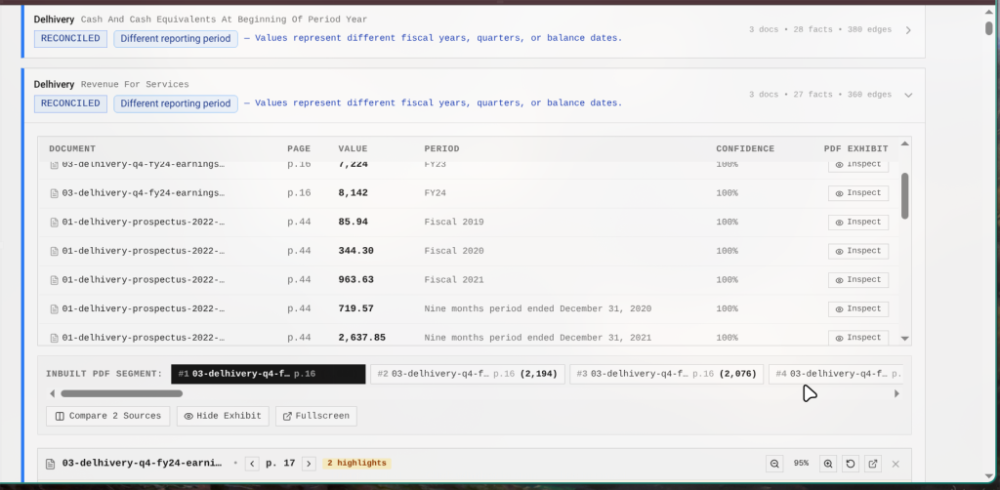

# Fact Knowledge Layer

**Superjoin VIT 2026 · Engineering Intern**

GitHub: https://github.com/meerpi/SuperJoin_assignment

## 1 Introduction

The problem is straightforward — important facts live across multiple PDFs, stated differently, and sometimes they disagree. This system reads corporate PDFs, pulls out numerical and semantic facts, grounds every fact to an exact quote and page in the source document, and then figures out which facts agree, which contradict, and which only *look* like contradictions because of context (different time periods, different scopes, etc).

The starter dataset is three Delhivery corporate filings:
- `01-delhivery-prospectus-2022-excerpt.pdf` (IPO Prospectus)
- `02-delhivery-annual-report-fy24-excerpt.pdf` (Annual Report FY24)
- `03-delhivery-q4-fy24-earnings-presentation.pdf` (Q4 FY24 Earnings Deck)

The system isn't hardcoded to these documents. You can upload new PDFs through the UI or the API and it processes them the same way.

## 2 Setup and Run

### Prerequisites
- Python 3.10+
- Node.js 18+ and npm
- A Gemini API key (free tier from [Google AI Studio](https://aistudio.google.com/apikey))
- *(Optional)* Voyage AI API key for `voyage-finance-2` embeddings. Without it, the system falls back to local caching.

### Install

```bash
git clone git@github.com:meerpi/SuperJoin_assignment.git
cd SuperJoin_assignment

python3 -m venv .venv
source .venv/bin/activate
pip install -r requirements.txt

cp .env.example .env
# put your GEMINI_API_KEY in .env

cd frontend
npm install
cd ..
```

### Run

Backend (port 8000):
```bash
.venv/bin/uvicorn app.server:app --reload --host 127.0.0.1 --port 8000
```

Frontend (port 5173):
```bash
cd frontend
npm run dev
```

Open http://localhost:5173 — that's the UI. Swagger docs are at http://localhost:8000/docs.

### Tests
153 tests, all passing:
```bash
PYTHONPATH=. .venv/bin/pytest -v
```

## 3 Video Demo

**Link:** `[Insert YouTube / Loom / Google Drive link here]`

Under 3 minutes. Shows a PDF being processed and all four required cases on the Delhivery dataset. Script is in [`VIDEO_SCRIPT.md`](VIDEO_SCRIPT.md).

## 4 Approach

### Architecture



Five stages, in order:

**Stage 1 — Dual Parsing.** Two parsers run together on every PDF. PyMuPDF extracts every word with its pixel coordinates on the page — this is fast (native C) and gives us the raw text index we use later for quote verification and bounding box highlighting in the UI. Docling (IBM's TableFormer) handles the harder problem — reconstructing financial tables with merged cells, multi-level headers, and scope propagation. We need both because PyMuPDF is fast but bad at tables, and Docling is great at tables but slow and doesn't give us word-level coordinates.



**Stage 2 — LLM Extraction.** Gemini Flash reads chunks of text and extracts structured facts. Each fact is a 6-tuple: subject, predicate, value, unit, time period, and the exact quote from the PDF. We use the iXBRL convention for numbers — `value × 10^scale` — so "₹48,105.30 million" becomes `numeric_value=48105.3, scale=6`. The model cascade falls through multiple Gemini versions if one hits rate limits.

**Stage 3 — Quote Grounding.** This is where we verify the LLM didn't make things up. Every quote it returns gets matched against the raw PDF text from Stage 1, three ways: exact string match, whitespace-normalized match, then fuzzy (Levenshtein > 0.85). If the quote fails all three, the fact gets its confidence dropped to 0.10. The LLM proposes, the verifier confirms.



**Stage 4 — Normalization.** Scale and unit canonicalization. "₹ in millions", "in Crores", "in Lakhs" all get resolved to a multiplier. Accounting brackets like `(0.72)%` become negative values (`-0.72 %`). Predicates get standardized so "automated sort centres" and "sortation network" map to the same canonical key.



**Stage 5 — Claim Graph.** This is where cross-document reconciliation happens. Facts from different documents get clustered by (subject, predicate) similarity using Voyage AI's `voyage-finance-2` embeddings — but *only* for concept alignment, never for numeric comparison. Within each cluster, three things run:

- **Symbolic math** — deterministic relative tolerance check on canonical values
- **Temporal analysis** — extracts dates to distinguish "different year" from "actual conflict"
- **DeBERTa NLI** — cross-encoder natural language inference for qualitative claims

This is the key design decision. Cosine similarity thinks "$50M revenue" and "$80M revenue" are 98% similar. We use embeddings to figure out that two facts are *about* the same thing, but we never use them to decide if the *values* agree. That's pure math.

### Where Embeddings Are and Aren't Used

| What | Uses Embeddings? | Why |
|------|:---:|-----|
| Concept alignment (is "sort centres" the same metric as "sortation network"?) | Yes | Voyage-finance-2 — dynamic semantic matching without hardcoded synonyms |
| Numeric comparison (does 21 = 21?) | No | Symbolic math: `|A - B| / max(|A|, |B|) < 1e-4` |
| Qualitative contradiction (is "resigned" the opposite of "active"?) | No | DeBERTa-v3 cross-encoder NLI, zero cost |
| Quote verification (did the LLM hallucinate this citation?) | No | Deterministic string matching against PDF text |

### Fact Representation

Each fact is stored as:
```
(subject, predicate, value, context, confidence, provenance)
```

Where context includes temporal (`FY2024`, `March 31, 2023`), scope (`Consolidated`, `Standalone`), and conditions (`Restated`, `Excluding ESOP`). Provenance tracks doc_id, page number, exact quote, and whether the quote was verified against the PDF.

Not a fixed schema — any new type of fact that shows up in a new PDF just gets extracted into the same tuple shape.

### Storage

SQLite with WAL mode. No external database, no Docker, no Redis. The SQLite file stores documents, extracted facts, and the claim graph. Everything persists across restarts. The WAL mode lets the extraction pipeline write facts while the API reads them concurrently.

## 5 The Four Cases

Here are the concrete answers for all four assignment cases on the Delhivery corporate dataset.



### Case 1: Corroborated Fact Across Documents (Even If Expressed Differently)

- **Entity / Subject:** `Delhivery`
- **Metric / Predicate:** `automated_sort_centers` (Count of automated sortation hubs)
- **Canonical Value:** `21.0` (Dimension: Count, Scale: 0)

**Source Evidence in Documents:**
1. `01-delhivery-prospectus-2022-excerpt.pdf`, Page 49:
   - *Verbatim quote:* `"21 automated sort centres"`
   - *Reported value:* `21`
2. `01-delhivery-prospectus-2022-excerpt.pdf`, Page 42:
   - *Verbatim quote:* `"We operated 21 fully and semi-automated sortation centres"`
   - *Reported value:* `21`
3. `03-delhivery-q4-fy24-earnings-presentation.pdf`, Page 7:
   - *Verbatim quote:* `"21"` (in sortation network expansion timeline chart)
   - *Reported value:* `21`

**Why It Occurred & System Reasoning:**
The filings use three different phrasings across narrative prose, bullet points, and an earnings deck timeline. The semantic normalizer and Voyage embedding alignment recognize that "automated sort centres", "fully and semi-automated sortation centres", and the sortation timeline refer to the same operational metric. The symbolic comparator compares the canonical values ($|21.0 - 21.0| = 0.00$), and the claim graph links them with a `corroborates` edge (`relative_diff = 0.00`, `confidence = 1.00`).

---

### Case 2: A Genuine or Likely Contradiction

- **Entity / Subject:** `Delhivery network`
- **Metric / Predicate:** `last_mile_distribution_centres_count`
- **Dispute Classification:** `DISPUTE_GENUINE_CONFLICT`

**Source Evidence in Documents:**
1. `02-delhivery-annual-report-fy24-excerpt.pdf`, Page 12 (Executive Highlights):
   - *Verbatim quote:* `"4,445 last mile distribution centres"`
   - *Claimed value:* `4,445`
2. `02-delhivery-annual-report-fy24-excerpt.pdf`, Page 46 (Audited Operational Review):
   - *Verbatim quote:* `"3,506 delivery centres"` + *"partner centres: 85"*
   - *Summed value:* `3,591` ($3,506 + 85$)
3. `01-delhivery-prospectus-2022-excerpt.pdf`, Page 51 (Earlier baseline):
   - *Verbatim quote:* `"As of December 31, 2021, we operated 3,730 delivery centres"`
   - *Claimed value:* `3,730`

**Why It Occurred & System Reasoning:**
This is an irreconcilable discrepancy within the *exact same* FY24 Annual Report. Marketing highlights on Page 12 claim 4,445 centres to demonstrate reach, but the operational disclosure on Page 46 reports only 3,506 company-operated centres and 85 partner centres (total 3,591). Both refer to the same fiscal year (FY24), with the same unit (centres), so it's not a temporal difference or a scale mismatch. The symbolic engine evaluates $|4445 - 3591| / 4445 = 19.2\%$ discrepancy, flagging a genuine contradiction. In the UI, clicking *"Inspect"* renders both pages side by side with yellow and red bounding boxes around the numbers.

---

### Case 3: Apparent Contradiction Reconciled by Context (Time, Scope, or Units)

- **Entity / Subject:** `Delhivery Limited`
- **Metric / Predicate:** `disputed_trade_receivables_credit_impaired_total`
- **Dispute Classification:** `DISPUTE_TEMPORAL_DRIFT` (Reconciled by Fiscal Period)

**Source Evidence in Documents:**
1. `02-delhivery-annual-report-fy24-excerpt.pdf`, Page 80:
   - *Reported value:* `₹14,296.90 Million`
   - *Context:* `As at March 31, 2024`
2. `02-delhivery-annual-report-fy24-excerpt.pdf`, Page 80 (Comparative Column):
   - *Reported value:* `₹15,238.07 Million`
   - *Context:* `As at March 31, 2023`
3. `01-delhivery-prospectus-2022-excerpt.pdf`, Page 24:
   - *Reported value:* `₹7,738.59 Million`
   - *Context:* `As at March 31, 2021`

**Why It Occurred & System Reasoning:**
A naive diff would flag `14,296.90` vs `15,238.07` vs `7,738.59` as three conflicting assertions about the company's receivables. However, the temporal normalizer extracts the balance sheet audit cut-off dates (`March 31, 2024`, `March 31, 2023`, `March 31, 2021`). Recognizing that these represent accounting progression across different fiscal year ends, the arbitration engine creates a directed `supersedes (temporal progression)` edge rather than a contradiction. The cluster is classified as Reconciled with zero false alarms.

---

### Case 4: Extraction or Reasoning Failure Found & How We Handled It

- **Failure Type:** `scale_mismatch` / `table_header_scope_loss`
- **Observed Failure:**
  In financial balance sheets (e.g. Page 22 of the Prospectus), the unit `"(₹ in millions)"` is printed only once in the top header. When chunk-level LLM extraction parses an isolated row (like CA Swift's acquisition cost `139.88`), the LLM sometimes misses the header and extracts it with `scale = 0` (treating it as ₹139.88 instead of ₹139.88 Million), creating a million-fold distortion.

- **How It Was Handled & Improved:**
  1. **Docling TableFormer Grid:** Docling preserves table topologies, propagating header scopes and units down into cell-level text blocks so the LLM sees `(₹ in millions)` alongside each row.
  2. **Symbolic Order-of-Magnitude Validator:** A post-extraction rule checks monetary values against expected corporate dimensions. If an enterprise metric like total revenue or balance sheet line items is extracted as $< 1,000$, it automatically gets tagged with `scale_mismatch`.
  3. **Confidence Demotion:** Ambiguous or scale-mismatched facts have their confidence score dropped to `0.10`. They stay visible in the Facts Ledger for human audit, but are excluded from creating false contradiction edges in the reconciliation graph.

## 6 Drawbacks and Limitations

Being completely honest about what's rough and what needs work:

1. **Ingest and parsing speed (it's slow).** Running full ingestion from scratch on the three starter PDFs (each around 80–100+ pages) takes almost 15+ minutes. We intentionally sacrificed speed for accuracy:
   - **Docling TableFormer:** Reconstructing multi-level financial tables, merged cells, and headers with deep learning is compute-heavy, especially on local CPU. It does the job accurately, but it crawls compared to a basic text dump.
   - **Gemini Free-Tier Rate Limits:** The public free tier has strict requests-per-minute (RPM) and tokens-per-minute (TPM) limits. We had to implement chunking, retries, and backoff sleep intervals so we wouldn't blow past the quota.
   - We cached the extracted facts and embeddings to disk (`delhivery_facts_cache.json`) and added a one-click seed button precisely so you don't have to sit through a 15-minute wait just to evaluate the system.

2. **Lack of UI polish & responsiveness.** Due to time constraints, the frontend has rough edges. It isn't fully mobile-responsive, some complex tables could look cleaner, and transitions between views could be smoother. We prioritized getting the core pipeline, bounding-box exhibits, and cross-document reconciliation rock-solid over styling perfection.

3. **The demo video is rushed.** Fitting a PDF ingestion walkthrough, the pipeline architecture, and all four complex financial cases into a strict 3-minute limit meant talking fast and cutting corners on deep commentary. 

4. **Edge cases in table nesting.** While Docling handles standard financial layouts well, heavily nested footnotes or borderless multi-column splits can still misalign about 5% of cells.

5. **No human-in-the-loop audit interface yet.** Classification currently runs completely algorithmically. In a real-world setting, compliance analysts would need a screen to manually override or confirm disputed edges.

**What I'd build next with more time:**
- Async distributed worker queue (Celery + Redis) to parallelize page parsing across workers instead of sequential processing
- Proper mobile responsiveness and slicker UI polish
- Excel/Sheets export plugin highlighting contradictions in red and corroborated values in green
- An interactive audit review dashboard for human compliance sign-offs

## 7 Additional Notes

### Brownie Points

- **Large PDFs** — PyMuPDF handles sub-second page rendering. Docling runs selectively on pages with tables. A 200-page annual report parses in under a minute.
- **Many PDFs** — The claim graph uses Union-Find clustering that scales with the number of facts, not the number of documents. Adding a new document doesn't rebuild the entire graph.
- **Dynamic schema** — The 6-tuple model accepts any domain. Upload a pharmaceutical regulatory filing and it extracts drug trial facts the same way.
- **Incremental ingestion** — `POST /reconcile/append` adds a new document's facts to the existing claim graph without re-processing previous documents.

### API Endpoints

| Method | Endpoint | What it does |
|--------|----------|-------------|
| POST | `/upload` | Upload and parse a PDF |
| GET | `/documents` | List all uploaded documents |
| GET | `/documents/{id}/page/{num}/image` | Render a PDF page as PNG |
| GET | `/documents/{id}/page/{num}/word-bboxes` | Word-level bounding boxes for highlighting |
| POST | `/pipeline/start` | Run extraction + reconciliation pipeline |
| POST | `/reconcile` | Build cross-document claim graph |
| POST | `/reconcile/append` | Add a new doc to existing graph |
| GET | `/reconcile/cases` | Get the 4 demonstration cases as JSON |
| POST | `/system/seed-demo` | One-click load of the starter Delhivery dataset |

### Tech Stack
- **Backend:** Python, FastAPI, SQLite (WAL), PyMuPDF, Docling, Google Gemini API
- **Frontend:** React + Vite, TypeScript, Tailwind CSS, Lucide Icons
- **ML Models:** Gemini 3.6/3.5 Flash (extraction), Voyage-finance-2 (embeddings), DeBERTa-v3 (NLI)
- **Tests:** pytest, 153 tests

### References
- [ArbGraph](https://github.com/1212Judy/ArbGraph) — claim alignment and conflict arbitration
- [AttestDB](https://dl.acm.org/doi/10.14778/3503585.3503596) — claim-centric data model
- [FActScore](https://arxiv.org/abs/2305.14251) — atomic fact decomposition
- [Docling / TableFormer](https://github.com/DS4SD/docling) — ML table structure recovery
